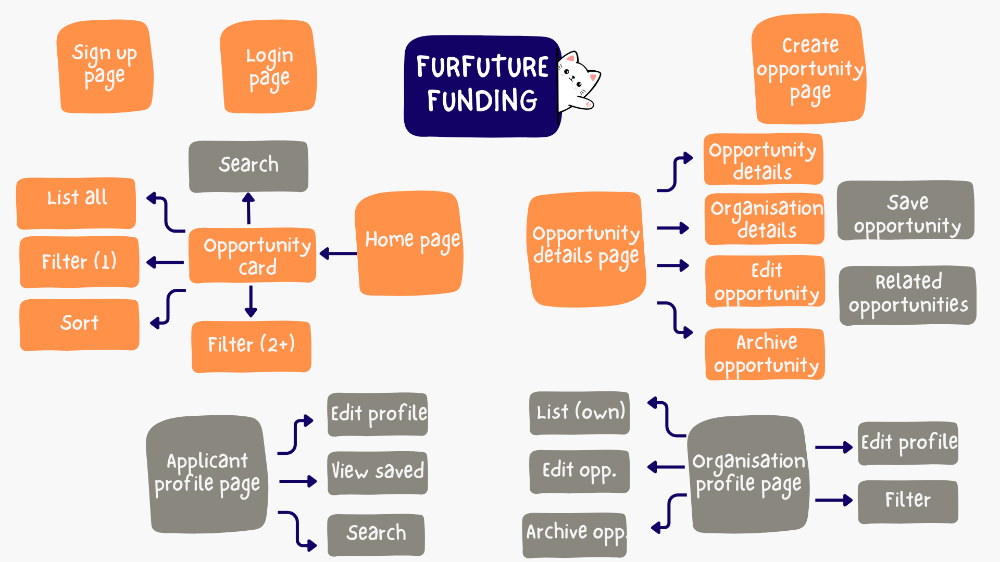
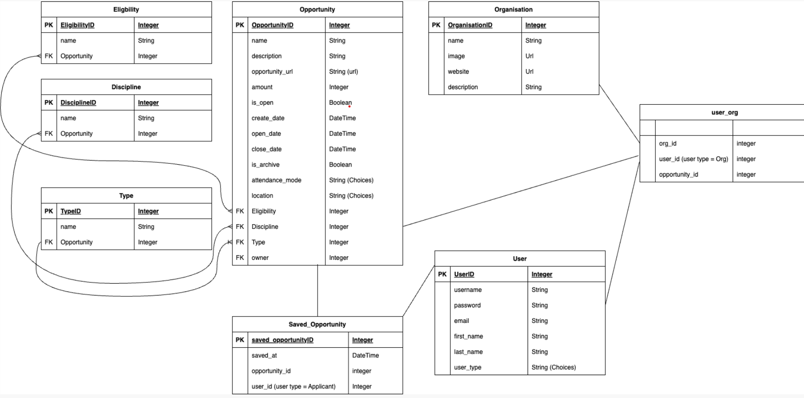

# Fur Future Funding

     

## Table of Contents

- [Fur Future Funding](#fur-future-funding)
  - [Table of Contents](#table-of-contents)
  - [Mission Statement](#mission-statement)
  - [Features](#features)
    - [Summary](#summary)
    - [Users](#users)
    - [Opportunity cards](#opportunity-cards)
    - [Opportunity listing](#opportunity-listing)
    - [Pages/Endpoint Functionality](#pagesendpoint-functionality)
    - [Nice To Haves](#nice-to-haves)
    - [Organisation profile page](#organisation-profile-page)
    - [Applicant profile page](#applicant-profile-page)
  - [Technical Implementation](#technical-implementation)
    - [Back-End](#back-end)
    - [Front-End](#front-end)
    - [Git \& Deployment](#git--deployment)
  - [Target Audience](#target-audience)
    - [Organisations](#organisations)
    - [Potential applicants](#potential-applicants)
  - [Back-end Implementation](#back-end-implementation)
    - [API Specification](#api-specification)
    - [Object Definitions](#object-definitions)
      - [User](#user)
      - [Organisation](#organisation)
      - [Opportunity](#opportunity)
      - [Eligibility](#eligibility)
      - [Discipline](#discipline)
      - [Type](#type)
      - [Saved_Opportunity](#saved_opportunity)
    - [Database Schema](#database-schema)

## Mission Statement

Fur Future Funding is a directory of scholarships and professional development opportunities specifically targeted at people from diverse or disadvantaged backgrounds.

Consolidating all opportunities in a single directory benefits both the organisations and potential applicants, connecting the right people to the right opportunity at the right time.

Scholarship and training providers often have small budgets and limited reach. Publishing on Fur Future Funding will help boost an organisation's profile and provide a no-cost option for advertising. It is planned to limit to listings by small not-for-profit organisations in the first instance.

Potential applicants can view, sort and filter hundreds of opportunities to create individualised views, saving time and effort to allow more time to apply for potential opportunities!

## Features

### Summary

The directory will enable Guest users to:

- view, sort and filter **opportunity cards** based on multiple criteria, and
- view the **opportunity listing** for additional details on the opportunity by selecting an opportunity card

Opportunity cards will provide a high-level snapshot of the opportunity, with clear tags to identify any categories that may be relevant to a potential applicant e.g. eligibility requirements, type of opportunity, location, attendance mode etc.

Authenticated users associated with an organisation (user_type == organisation) can:

- create new opportunity listings,
- update existing listings they created, and
- archive listings they created.

### Users

| Type                | Access                                                                                                                                              | Role type assignment                  |
| ------------------- | --------------------------------------------------------------------------------------------------------------------------------------------------- | ------------------------------------- |
| Superuser or admin  | - Can log in - Can log out - Create/Edit/Delete Discipline areas - Create/Edit/Delete Type - Create/Edit/Delete scholarship Eligibility | Site owner(s)                         |
| User (Organisation) | - Can log in - Can log out - Create new opportunities - Edit opportunity they own                                                          | Users associated with an organisation |
| Guest user          | - View, filter and sort opportunity cards - View opportunity details                                                                             | Public: Users who visit website       |

### Opportunity cards

Opportunity cards are automatically generated when a new listing is created. They appear on the front page of the directory and provide the access point for the user to discover more information on the opportunity.

| Feature | Access                                       | Notes/Conditions                                                                                                     |
| :------ | :------------------------------------------- | :------------------------------------------------------------------------------------------------------------------- |
| View    | Can be viewed by anyone visiting the website |   - Opportunity cards fixed format and cannot be edited by user   - Default view order is by date created      |
| Sort    | Can be done by anyone visiting the website   | - Set sort order (closing date descending or ascending)                                                              |
| Filter  | Can be done by anyone visiting the website   | - Filter by eligibility type   - Filter by location   - Filter by discipline   - Filter by multiple filters |
| Post    | Post as logged in user (organisation)        | - Submit new opportunity listing to create opportunity card                                                          |

### Opportunity listing

| Feature | Access                                       | Notes/Conditions                                                                                                                                                                                                                                                                            |
| :------ | :------------------------------------------- | :------------------------------------------------------------------------------------------------------------------------------------------------------------------------------------------------------------------------------------------------------------------------------------------ |
| View    | Can be viewed by anyone visiting the website | - Opportunity listing fixed format and cannot be edited by user   - Opportunity listing can only be accessed via opportunity card                                                                                                                                                        |
| Post    | Post as logged in user (organisation)        | - Submit new opportunity listing to create an opportunity listing view   - All fields are mandatory, including organisation details                                                                                                                                                      |
| Edit    | Edit as logged in user (organisation)        |   - Logged in user must be owner of opportunity listing   - All fields are editable   - Organisation details cannot be edited from the opportunity listing   - Logged in user can archive their own opportunity listings. This automatiocally update status from open to close. |

### Pages/Endpoint Functionality

| Endpoint                      | Functionality                                                                                                                                              | Comments                                                                                                                                                  |
| :---------------------------- | :--------------------------------------------------------------------------------------------------------------------------------------------------------- | :-------------------------------------------------------------------------------------------------------------------------------------------------------- |
| Home page                     | - Visible to all users   - Cards displayed automatically update when new opportunity added or removed   - Options to sort and filter displayed cards | - Developed as ‘mobile first’   - Easy to read and accessible   - Good contrast                                                                     |
| Opportunity card              | - Visible to all users   - Provides access to opportunity details page                                                                                  | - Content updated if owner updates details                                                                                                                |
| Create opportunity page       | - Only visible to logged in users associated with an organisation   - Save form to create new opportunity listing                                       | - Developed as ‘desktop first’   Requires authentication                                                                                               |
| View opportunity details page | - Displays details of individual opportunity   - Displays associated organisation’s details                                                             |   - Can only be accessed via opportunity card (i.e. not visible in site architecture)   - Contains edit and archive functions for opportunity owner |

### Nice To Haves

- The features which are in the MVP are in orange and the nice-to-have features are in grey.

### Organisation profile page

- User associated with an organisation can view, edit and archive all the opportunities they have created from the profile page.
- User associated with an organisation can edit the organisation details from the users profile page.
- Note backend has been set up to allow for multiple users to be associated with a single organisation.

### Applicant profile page

- User as applicant type can view and edit profile.
- User can save opportunities (via the opportunity listing page) and view the saved results in their profile.
- Note backend has been set up to enable saving opportunities.

## Technical Implementation

### Back-End

- Django / DRF API
- Python

### Front-End

- React / JavaScript
- HTML/CSS

### Git & Deployment

- Heroku
- Netlify
- GitHub

This application's back-end is deployed to Heroku. The front-end is deployed separately to Netlify.

We used Insomnia to ensure API endpoints were working smoothly.

Git Project was used to allocate and manage tasks and issues.

## Target Audience

This website has two major target audiences:

- Organisations looking to list opportunities in the directory, and
- Potential applicants looking for scholarship opportunities.

### Organisations

Organisation administrators will use the website to create new opportunity listings on the site. The administrators will then be able to edit an opportunity to change the status of the opportunity e.g. update open or closing date.

### Potential applicants

General public will use this website to view scholarships opportunities that might be available to them. Potential applicants will not need to log in to view, sort and filter potential opportunities.

## Back-end Implementation

### API Specification

Public website

| HTTP Method | URL               | Purpose                                                                                                             | Request Body                                                                                                                                                                                                                                                                                                                              | Successful Response Code | Authentication and Authorization     |
| :---------- | :---------------- | :------------------------------------------------------------------------------------------------------------------ | :---------------------------------------------------------------------------------------------------------------------------------------------------------------------------------------------------------------------------------------------------------------------------------------------------------------------------------------- | :----------------------- | :----------------------------------- |
| POST        | /api-token-auth   | Allow users to log in                                                                                               |   “Username”: “string”   “Password”: “String”                                                                                                                                                                                                                                                                                       | 200                      | Account owner                        |
| GET         | /users            | Get a list of all users                                                                                             |                                                                                                                                                                                                                                                                                                                                           | 200                      | Admin                                |
| POST        | /users            | Create new account for nonprofit                                                                                    |   "username": "string", "password": "string", "email": "string", "first_name": "string", "last_name": "string", "organisation": { "name": "Tech Innovators Ltd.", "image": "https://example.com/logo.png", "website": "https://techinnovators.com", "description": "A leading tech solutions provider." }, "user_type": "Organisation" | 201                      | None                                 |
| GET         | /users/id         | Get the details of a user account, their associated organisation and their associated opportunities                 |                                                                                                                                                                                                                                                                                                                                           | 200                      | None                                 |
| PUT         | /users/id         | Edit the details of a user account                                                                                  | “selected_field_to_update”:”updated_info”                                                                                                                                                                                                                                                                                                 | 201                      | Account owner                        |
| DELETE      | /users/id         | Delete a user account                                                                                               | 204                                                                                                                                                                                                                                                                                                                                       | Admin                    |
| POST        | /opportunities    | Create a new opportunity                                                                                            | "title": "string", "description": "string.", "listing_url": "string", "amount": int, "close_date": "DateTime", "study_mode": "string", "location": "string", "status": "boolean", "eligibility": int (FK), "discipline": int (FK) , "type": int (FK)                                                                                      | 201                      | User with an account (Account Owner) |
| GET         | /opportunities    | Returns all opportunities                                                                                           |                                                                                                                                                                                                                                                                                                                                           | 200                      | All                                  |
| GET         | /opportunities/id | Returns a scholarship listing   Can filter by discipline, location, study_field, close_date, in_person or online | Returns request body                                                                                                                                                                                                                                                                                                                      | 200                      | All                                  |
| PUT         | /opportunities/id | Update the details of an opportunity e.g. archiving                                                                 | “selected_field_to_update”:”updated_info”                                                                                                                                                                                                                                                                                                 | 201                      | Opportunity owner                    |
| GET         | /eligibilities    | Get all the available eligibilities                                                                                 |                                                                                                                                                                                                                                                                                                                                           | 200                      | None                                 |
| POST        | /eligibilities    | Create a new eligibility                                                                                            | “name”:” string”                                                                                                                                                                                                                                                                                                                          | 201                      | Admin                                |
| GET         | /eligibilities/id | View the info of one eligibility criteria                                                                           |                                                                                                                                                                                                                                                                                                                                           | 200                      | Admin                                |
| PUT         | /eligibilities/id | Update an eligibility                                                                                               | “name”:”string”                                                                                                                                                                                                                                                                                                                           | 201                      | Admin                                |
| DELETE      | /eligibilities/id | Delete an eligibility                                                                                               |                                                                                                                                                                                                                                                                                                                                           | 204                      | Admin                                |
| GET         | /disciplines      | Get all the available disciplines                                                                                   |                                                                                                                                                                                                                                                                                                                                           | 200                      | None                                 |
| POST        | /disciplines      | Create a new discipline                                                                                             | “name”:” string”                                                                                                                                                                                                                                                                                                                          | 201                      | Admin                                |
| GET         | /disciplines/id   | View the info on one discipline                                                                                     |                                                                                                                                                                                                                                                                                                                                           | 200                      | Admin                                |
| PUT         | /disciplines/id   | Update a discipline                                                                                                 | “name”:”string”                                                                                                                                                                                                                                                                                                                           | 201                      | Admin                                |
| DELETE      | /disciplines/id   | Delete a discipline                                                                                                 |                                                                                                                                                                                                                                                                                                                                           | 204                      | Admin                                |
| GET         | /types            | Get all the available scholarship types                                                                             |                                                                                                                                                                                                                                                                                                                                           | 200                      | None                                 |
| POST        | /types            | Create a new scholarship type                                                                                       | “name”:” string”                                                                                                                                                                                                                                                                                                                          | 201                      | Admin                                |
| GET         | /types/id         | View the info of one scholarship type                                                                               |                                                                                                                                                                                                                                                                                                                                           | 200                      | Admin                                |
| PUT         | /types/id         | Update a scholarship type                                                                                           | “name”:”string”                                                                                                                                                                                                                                                                                                                           | 201                      | Admin                                |
| DELETE      | /types/id         | Delete a scholarship type                                                                                           |                                                                                                                                                                                                                                                                                                                                           | 204                      | Admin                                |

### Object Definitions

#### User

| Field            | Data type        |
| :--------------- | :--------------- |
| _UserID (PK)_    |                  |
| _username_       | String           |
| _password_       | String           |
| _email_          | String           |
| first_name       | String           |
| last_name        | String           |
| user_type        | String (Choices) |
| Opportunity (FK) | Integer          |

#### Organisation

| Field                 | Data type |
| :-------------------- | :-------- |
| _OrganisationID (PK)_ |           |
| name                  | String    |
| image                 | URL       |
| website               | URL       |
| description           | String    |

#### Opportunity

| Field                | Data type        |
| :------------------- | :--------------- |
| _OpportunityID (PK)_ |                  |
| name                 | String           |
| description          | String           |
| opportunity_url      | URL              |
| amount               | Integer          |
| is_open              | Boolean          |
| create_date          | DateTime         |
| open_date            | DateTime         |
| close_date           | DateTime         |
| is_archive           | Boolean          |
| attendance_mode      | String (Choices) |
| location             | String (Choices) |
| Eligibility (FK)     | Integer          |
| Discipline (FK)      | Integer          |
| Type (FK)            | Integer          |
| owner (FK)           | Integer          |
| organisation (FK)    | Integer          |

#### Eligibility

| Field                | Data type |
| :------------------- | :-------- |
| _EligibilityID (PK)_ |           |
| name                 | String    |
| Opportunity (FK )    | Integer   |

#### Discipline

| Field               | Data type |
| :------------------ | :-------- |
| _DisciplineID (PK)_ |           |
| name                | String    |
| Opportunity (FK )   | Integer   |

#### Type

| Field             | Data type |
| :---------------- | :-------- |
| _TypeID (PK)_     |           |
| name              | String    |
| Opportunity (FK ) | Integer   |

#### Saved_Opportunity

| Field                              | Data type |
| :--------------------------------- | :-------- |
| _Saved_Opportunity_ID (PK)_        |           |
| saved_at                           | DateTime  |
| Opportunity (FK )                  | Integer   |
| User (user_type = Applicant) (FK ) | Integer   |

### Database Schema

